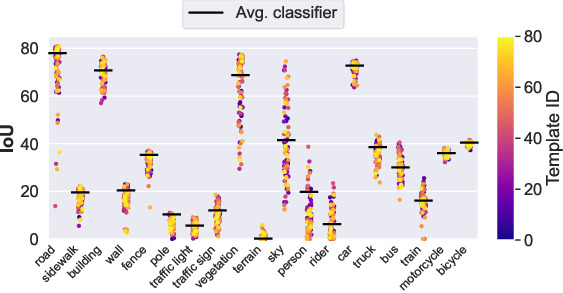

# FLOSS: Free Lunch in Open-vocabulary Semantic Segmentation

<!-- [](https://paperswithcode.com/paper/TODO) -->
[](https://yasserben.github.io/FLOSS/)
[](https://colab.research.google.com/github/yasserben/FLOSS/blob/main/notebooks/FLOSS_Reproducibility.ipynb)
[](https://arxiv.org/abs/2504.10487)

This is the official implementation of our paper:  
**FLOSS: Free Lunch in Open-vocabulary Semantic Segmentation**  
[Yasser Benigmim](https://yasserben.github.io/), [Mohammad Fahes](https://github.com/mfahes), [Tuan-Hung Vu](https://tuanhungvu.github.io/), [Andrei Bursuc](https://abursuc.github.io/), [Raoul de Charette](https://team.inria.fr/rits/membres/raoul-de-charette/)

<!-- [Project Page](TODO) | [ArXiv](TODO) -->

## Overview

<p align="center">
  
  <br>
  <em>Key observation: For each class, there exist individual templates (colored dots) that perform better than the conventional averaged classifier using all 80 templates.</em>
</p>

**FLOSS challenges the conventional wisdom of using averaged templates in CLIP-based OVSS models by:**

1. **Identifying expert templates for each class that outperform averaged classifiers**
2. **Using entropy as the unsupervised metric to select these experts without labels**
3. **Introducing a novel fusion scheme to combine expert predictions**
4. **Providing a plug-and-play solution requiring no training or labels**

# Table of Contents
- [Overview](#overview)
- [News](#news)
- [Notebook](#notebook)
- [Installation](#installation)
- [Data Preparation](#data-preparation)
- [Evaluating Models](#evaluating-models)
- [Computing Template Rankings](#computing-template-rankings)
- [Results](#results)
- [Citation](#citation)

## News

- 🚀 **New (02/2026): FLOSS notebook is released**

## Notebook

**Reproduce FLOSS results with a single end-to-end pipeline, run evaluation and ranking experiments directly in Colab, and replace entropy with your own unsupervised metric to compare outcomes immediately.**

Colab: [Open FLOSS_Reproducibility.ipynb](https://colab.research.google.com/github/yasserben/FLOSS/blob/main/notebooks/FLOSS_Reproducibility.ipynb)

Local Jupyter: [`notebooks/FLOSS_Reproducibility.ipynb`](notebooks/FLOSS_Reproducibility.ipynb)

To run it locally:

```bash
jupyter notebook notebooks/FLOSS_Reproducibility.ipynb
```

## Installation

1. Create and activate a conda environment:
```bash
conda create -n floss python=3.9
conda activate floss
```

2. Install numpy and PyTorch with CUDA support:
```bash
# For CUDA 12.4 (tested version)
pip install numpy==1.26.4 torch==2.6.0 torchvision==0.21.0
```

3. Install the remaining dependencies:
```bash
pip install -r requirements.txt
```

> [!NOTE]
> This code has been tested with CUDA 12.4. Make sure you have the appropriate CUDA version installed on your system.

## Data Preparation

Download and process the datasets following the [MMSegmentation guide](https://github.com/open-mmlab/mmsegmentation/blob/main/docs/en/user_guides/2_dataset_prepare.md). Place all datasets in `./data` with the following structure:
```
data/
  ├── cityscapes/
  ├── VOCdevkit/VOC2012/  # PASCAL VOC20
  ├── VOCdevkit/VOC2010/  # PASCAL CO59
  ├── ade20k/
  ├── coco_stuff164k/
  ├── mapillary/
  ├── bdd10k/
  └── acdc/              # Night, Fog, Rain, Snow conditions
```

After downloading, run these conversion scripts:
```bash
# COCO-Stuff: Convert annotations to semantic segmentation format
python tools/convert_datasets/coco_stuff16k.py data/coco_stuff164k/ -o data/coco_stuff164k/

# Cityscapes: Generate *labelTrainIds.png
python tools/convert_datasets/cityscapes.py data/cityscapes --nproc 8

# PASCAL Context: Convert annotations (requires Detail package)
python tools/convert_datasets/pascal_context.py data/VOCdevkit data/VOCdevkit/VOC2010/trainval_merged.json

# Mapillary: Convert to Cityscapes format and resize validation set
python tools/convert_datasets/mapillary2cityscape.py data/mapillary data/mapillary/cityscapes_trainIdLabel --train_id
python tools/convert_datasets/mapillary_resize.py data/mapillary/validation/images \
    data/mapillary/cityscapes_trainIdLabel/val/label \
    data/mapillary/half/val_img \
    data/mapillary/half/val_label
```

## Evaluating Models

Download the [CLIP-DINOiser checkpoint](https://drive.google.com/file/d/1juyBB0zlEShwThoZ1PzHIIHO-l_qmdro/view?usp=sharing) and place it in `checkpoints/clip_dinoiser/`.

To evaluate the baseline models (without FLOSS):

```bash
# Evaluate baseline models (without FLOSS)

# For CLIP-DINOiser
python ./tools/test.py configs/clipdinoiser.py --dataset DATASET

# For MaskCLIP
python ./tools/test.py configs/maskclip.py --dataset DATASET

# For NACLIP
python ./tools/eval_naclip.py --dataset DATASET
```

To evaluate with FLOSS (requires pre-computed rankings available in `rankings/` directory, see [Computing Template Rankings](#computing-template-rankings) to reproduce them):

```bash
# For CLIP-DINOiser + FLOSS
python ./tools/test.py configs/clipdinoiser.py --dataset DATASET --mode fusion

# For MaskCLIP + FLOSS
python ./tools/test.py configs/maskclip.py --dataset DATASET --mode fusion

# For NACLIP + FLOSS
python ./tools/eval_naclip.py --dataset DATASET --mode fusion
```

Replace `DATASET` with one of: `cityscapes`, `pascalvoc20`, `pascalco59`, `ade20k`, `cocostuff`, `mapillary`, `bdd10k`, or `acdc_night`, `acdc_snow`, `acdc_rain` `acdc_fog`.

## Computing Template Rankings

To reproduce the rankings:

```bash
# For CLIP-DINOiser on a regular size dataset
python ./tools/test.py configs/clipdinoiser.py --dataset DATASET --mode compute_metric --split train

# For CLIP-DINOiser on ADE20K (dividing the 80 templates into groups of 10)
python ./tools/test.py configs/clipdinoiser.py --dataset ade20k --mode compute_metric --split train --id-start 0 --id-end 9
python ./tools/test.py configs/clipdinoiser.py --dataset ade20k --mode compute_metric --split train --id-start 10 --id-end 19
python ./tools/test.py configs/clipdinoiser.py --dataset ade20k --mode compute_metric --split train --id-start 20 --id-end 29
# ... continue with remaining template ranges (30-39, 40-49, etc.)
```

> [!TIP]
> When computing metrics, you can use the training set by specifying `--split train`. However, be aware that processing large datasets like ADE20K and COCO-Stuff requires significant computational resources - ideally a GPU with 40GB of memory 💾. To make this process more manageable, you can process the templates in smaller batches using `--id-start` and `--id-end`. For example, instead of processing all 80 templates at once, you can process them in groups (e.g., templates 0-9, then 10-19, etc.). This allows you to parallelize the work across multiple processes, making it more efficient for large-scale datasets.

## Results

| Method | Cityscapes | VOC20 | CO59 | ADE20K | Stuff | Avg |
|--------|------------|--------------|-------------|---------|------------|-----|
| MaskCLIP | 25.0 | **61.8** | 25.5 | 14.2 | 17.5 | 28.7 |
| + FLOSS | **25.8** | **61.8** | **26.2** | **14.9** | **17.8** | **29.3** |
| NACLIP | 35.5 | 79.7 | 35.2 | 17.4 | 23.3 | 38.2 |
| + FLOSS | **37.0** | **80.2** | **35.9** | **18.4** | **23.6** | **39.0** |
| CLIP-DINOiser | 31.1 | 80.9 | 35.9 | 20.0 | 24.6 | 38.5 |
| + FLOSS | **34.6** | **82.3** | **36.2** | **20.7** | **24.7** | **39.7** |

## Citation

If you find this work useful, please cite our paper:
```bibtex
@misc{benigmim2025flossfreelunchopenvocabulary,
      title={FLOSS: Free Lunch in Open-vocabulary Semantic Segmentation},
      author={Yasser Benigmim and Mohammad Fahes and Tuan-Hung Vu and Andrei Bursuc and Raoul de Charette},
      year={2025},
      eprint={2504.10487},
      archivePrefix={arXiv},
      primaryClass={cs.CV},
      url={https://arxiv.org/abs/2504.10487},
}
```

## Acknowledgments

We would like to thank the authors of [MMSegmentation](https://github.com/open-mmlab/mmsegmentation), [CLIP-DINOiser](https://github.com/wysoczanska/clip_dinoiser), and [NACLIP](https://github.com/sinahmr/NACLIP) for making their code publicly available. Our implementation builds upon their excellent work.

[Back to Top](#table-of-contents)